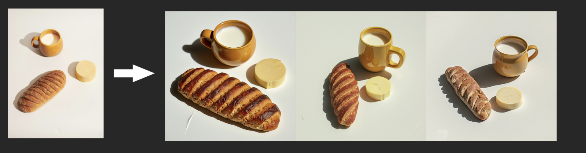

# AI Content Generation

- **Generate photo and video content with AI**:

  - [Upload selfies](https://photoai.com/#selfies) and create your own [Flux™ AI model](https://photoai.com/#model)
  - 📸 [Take 100% AI photos](https://photoai.com/#prompt) in any pose, place, or action
  - 🎞️ [Create 100% AI videos](https://photoai.com/#video) from any AI photo you take
  - Create AI images for your cats and dogs (WHY NOT?).

# FLUX

The **FLUX** family of models makes it easy to generate and edit images.

## 1. Text to Image

### FLUX1.1 Pro
Fast, high-quality generation. Good for:
- Professional work
- Commercial projects (E-commerce, Shopify)
- When you need very good results

## 2. Image Editing

### FLUX.1 Fill
Professional inpainting and outpainting. Good for:
- Removing or replacing objects
- Extending images beyond their borders
- Seamless, natural edits

### FLUX.1 Depth & Canny
Structure-preserving image editing. Good for:
- Retexturing while keeping 3D relationships
- Turning sketches into detailed images
- Controlled style transfer

[FLUX.1 Depth →](https://replicate.com/black-forest-labs/flux-depth-pro)  
[FLUX.1 Canny →](https://replicate.com/black-forest-labs/flux-canny-pro)

### FLUX.1 Redux
Image variations and restyling. Good for:
- Creating variations of existing images
- Mixing images with text prompts
- Rapid iteration on designs

[Try FLUX.1 Redux →](https://replicate.com/black-forest-labs/flux-redux-dev)

## 3. Dreambooth

  
[DREAMBOOTH →](https://dreambooth.github.io/)

## 4. Remove Backgrounds

Remove backgrounds from images and videos automatically.

- Remove backgrounds from images: [men1scus/birefnet](https://replicate.com/men1scus/birefnet)
- Remove backgrounds from videos: [arielreplicate/robust_video_matting](https://replicate.com/arielreplicate/robust_video_matting)

## 5. Use a Face to Make Images

These models let you generate realistic images, art, and avatars from a simple face image. Transform faces into new visual styles while preserving the subject’s identity and features.

### Key capabilities:
- **Photo generation**: Create realistic photos of a person in different contexts, outfits, hairstyles, etc.
- **Artistic rendering**: Transform a photo into paintings, sketches, anime, and other artistic styles.
- **Avatar creation**: Generate profile pictures, game characters, emoji, and 3D avatars matching a face.

**Best for most people**: [PhotoMaker](https://replicate.com/tencentarc/photomaker)  
**Face to many**: [Face to many](https://replicate.com/fofr/face-to-many)

---

### To sum it up, the **FLUX.1 Tools** lineup includes:

- **Fill**: Inpainting and outpainting, like a magic AI paintbrush for precise edits.
- **Canny**: Use edge detection to generate images with precise structure.
- **Depth**: Use depth maps to generate images with realistic perspective.
- **Redux**: An adapter for the FLUX.1 base models that you can use to create variations of images.

## App Key Features:

- AI Image Generator:    
    - Transform your text into vivid visuals in styles like realism, anime, or illustrations.

- Pro Editing Suite:
    - Background Eraser: Precision removal of backgrounds.
    - Object Remover
    - Hair STyle changer (enhancer?)
    - photo Colorize!?
    - Cats & Dogs AI-ish stuff.
    - Babies as well? Maybe.
    - Image Enhancer: Upscale and refine your images to perfection.
    - Style Remix: Capture and modify styles from any image.
    - Image to Avatars, Pixar

- Multilingual Magic:    
    - Use the app in English, Spanish, German, Italian, French, etc. Prompts in your language, results in your vision.

- Prompt Perfection:    
    - Enhance your prompts for better image alignment with your ideas. (we can you another model to do this. quit easy)
    
- Share with Ease:
    - Instantly share your AI-crafted art across social platforms.

## Other Features
1. Collaborative Creativity:
  - Co-Creation Mode: Allow users to collaborate in real-time. One user can start with a prompt, and others can add or modify elements, leading to a shared final image.

3. Personalization and Customization:
  - User Style Profiles: Users can save preferred styles or themes, allowing for quick generation of images in their favorite aesthetics without redefining every prompt.
  - AI Assistants for Personal Projects: Offer AI-guided project templates, like creating a series of images for a story or a comic strip.

4. Interactive and Dynamic Content:
  - Interactive Images: Create images where parts can be altered by the viewer (e.g., changing expressions, backgrounds, or items within the image).  
  - Animated Stamps or GIFs: Beyond static images, allow users to create short animations or moving elements that can be used as stamps for social media or messaging apps.
    
5. Feedback Loop and Improvement:
  - User Feedback Mechanism: Users can rate or review the AI's output, helping refine the model's understanding of user preferences over time.

### Face swap:
https://replicate.com/xiankgx/face-swap/

